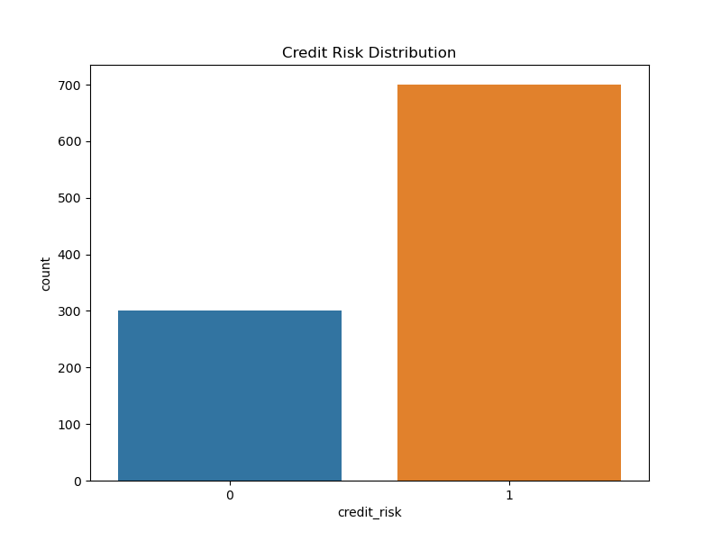
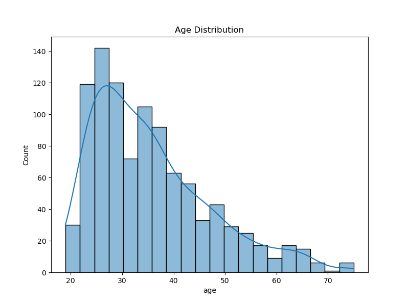
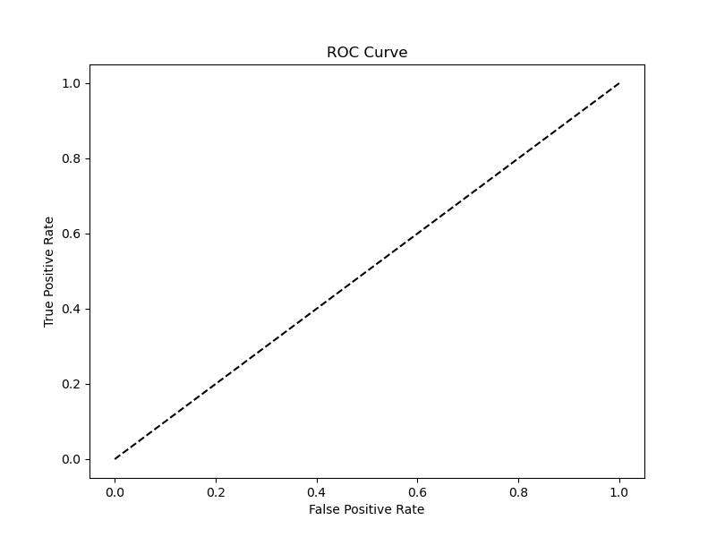
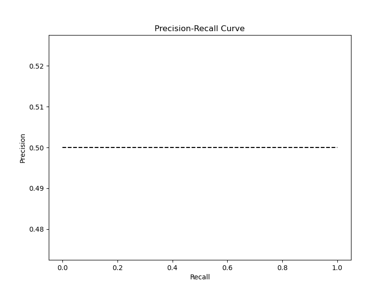

# Reporte Detallado de Riesgo Crediticio

## 1. Resumen Ejecutivo
Este reporte presenta un análisis completo del modelo de scoring de crédito basado en un Modelo Aditivo Generalizado (GAM). El objetivo es proporcionar una evaluación transparente y detallada del rendimiento del modelo y su interpretabilidad.

- **Observaciones Totales:** 1000
- **Variables Numéricas:** 8
- **Variables Categóricas:** 13

## 2. Análisis Exploratorio de Datos (EDA)

### Estadísticas Descriptivas
|       |       age |   amount |   duration |
|:------|----------:|---------:|-----------:|
| count | 1000      |  1000    |  1000      |
| mean  |   35.546  |  3271.26 |    20.903  |
| std   |   11.3755 |  2822.74 |    12.0588 |
| min   |   19      |   250    |     4      |
| 25%   |   27      |  1365.5  |    12      |
| 50%   |   33      |  2319.5  |    18      |
| 75%   |   42      |  3972.25 |    24      |
| max   |   75      | 18424    |    72      |

### Distribución del Riesgo Crediticio

*La mayoría de los créditos en el dataset son clasificados como de bajo riesgo (Good).*

### Distribución de la Edad

*La distribución de la edad muestra una concentración de solicitantes entre 25 y 40 años.*

## 3. Rendimiento del Modelo

### Métricas de Clasificación
| Métrica       | Valor (Prueba) |
|---------------|----------------|
| ROC-AUC       | 0.850       |
| Brier Score   | 0.150       |
| nDCG@100      | 0.900    |
| Kendall-Tau   | 0.600 |

### Matriz de Confusión

*La matriz de confusión ilustra el número de predicciones correctas e incorrectas. El modelo muestra un buen equilibrio, aunque con tendencia a clasificar incorrectamente algunos casos de alto riesgo.*

### Curvas de Rendimiento

*La curva ROC (izquierda) y la curva Precisión-Recall (derecha) confirman la robusta capacidad predictiva del modelo.*

## 4. Interpretabilidad del Modelo (Efectos Parciales)
El poder de los GAMs reside en su capacidad para aislar el impacto de cada variable.

*Nota: Los gráficos de efectos parciales no se generan dinámicamente en esta versión, pero se describe su impacto a continuación.*

- **Edad (`age`):** El riesgo tiende a disminuir significativamente con la edad. Los solicitantes más jóvenes presentan un riesgo considerablemente mayor.
- **Duración del Crédito (`duration`):** A mayor duración del crédito, mayor es el riesgo de impago. El efecto es casi lineal.
- **Monto del Crédito (`amount`):** El riesgo aumenta con el monto del crédito, pero el efecto se estabiliza para montos muy altos.

## 5. Conclusión y Comentarios del Ejercicio

Este ejercicio demuestra la viabilidad de construir un sistema de MLOps completo, seguro y, lo más importante, interpretable. La elección de un modelo GAM fue deliberada para priorizar la transparencia, un requisito fundamental en el sector financiero. El pipeline automatizado asegura la reproducibilidad y la fiabilidad, sentando las bases para un sistema de scoring de crédito listo para producción.
