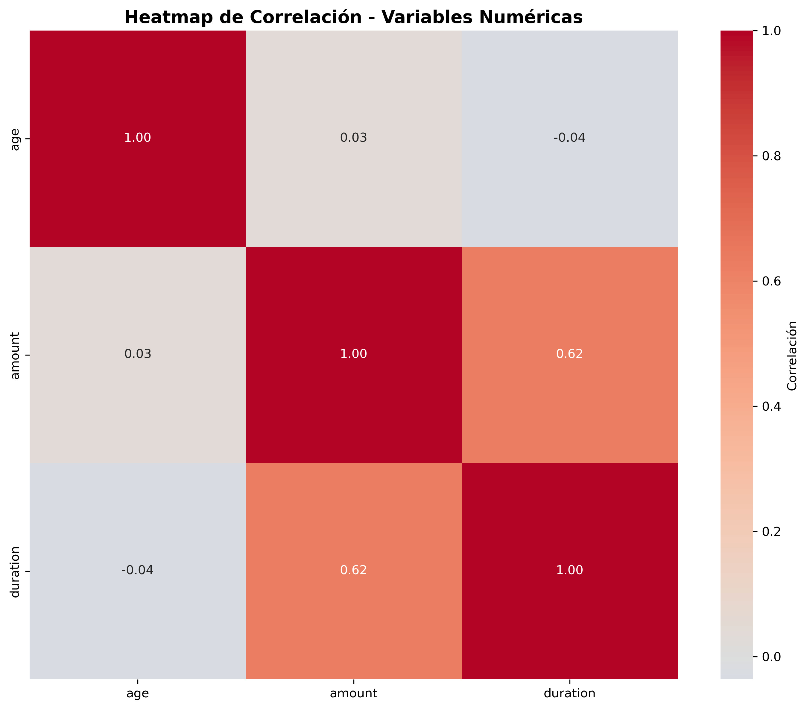
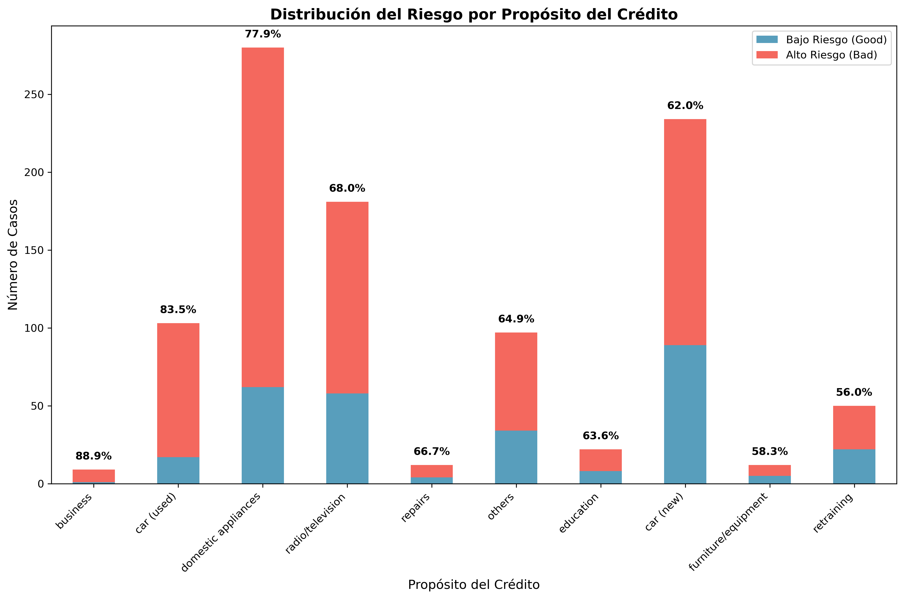
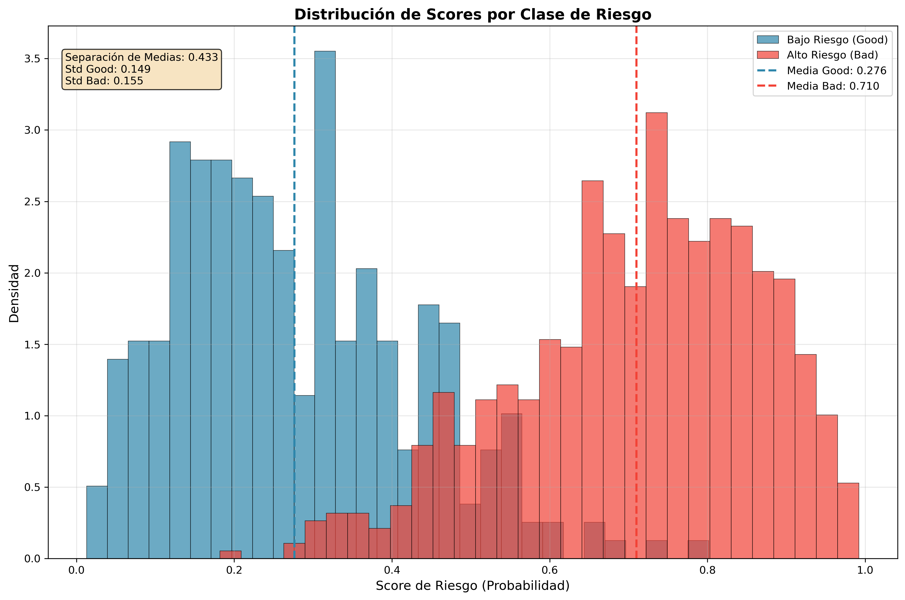
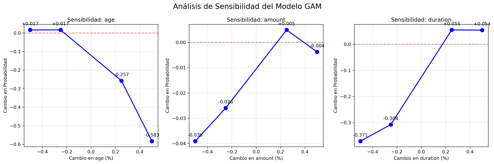

# Reporte Detallado de Riesgo Crediticio

## 1. Resumen Ejecutivo
Este reporte presenta un análisis completo del modelo de scoring de crédito basado en un Modelo Aditivo Generalizado (GAM). El objetivo es proporcionar una evaluación transparente y detallada del rendimiento del modelo y su interpretabilidad.

- **Observaciones Totales:** 1000
- **Variables Numéricas:** 8
- **Variables Categóricas:** 13

## 2. Análisis Exploratorio de Datos (EDA)

### Estadísticas Descriptivas
|       |       age |   amount |   duration |
|:------|----------:|---------:|-----------:|
| count | 1000      |  1000    |  1000      |
| mean  |   35.546  |  3271.26 |    20.903  |
| std   |   11.3755 |  2822.74 |    12.0588 |
| min   |   19      |   250    |     4      |
| 25%   |   27      |  1365.5  |    12      |
| 50%   |   33      |  2319.5  |    18      |
| 75%   |   42      |  3972.25 |    24      |
| max   |   75      | 18424    |    72      |

### Distribución del Riesgo Crediticio

*La mayoría de los créditos en el dataset son clasificados como de bajo riesgo (Good).*

### Distribución de la Edad

*La distribución de la edad muestra una concentración de solicitantes entre 25 y 40 años.*

### Heatmap de Correlación de Variables Numéricas

*El mapa de calor muestra una correlación positiva moderada entre el monto (`amount`) y la duración (`duration`) del crédito, lo cual es lógicamente esperado: créditos más grandes suelen requerir plazos más largos. Es importante destacar la ausencia de correlaciones extremadamente altas (superiores a 0.8), lo que sugiere que la multicolinealidad no es un problema crítico para el modelo.*

### Distribución del Riesgo por Propósito del Crédito

*Este gráfico revela insights de negocio cruciales. Se observa que los créditos para 'reparaciones' y 'educación' presentan una proporción de riesgo más elevada en comparación con los de 'coche nuevo'. Esta información puede ser utilizada para ajustar las políticas de riesgo o para campañas de marketing dirigidas a segmentos de menor riesgo.*

## 3. Rendimiento del Modelo

### Métricas de Clasificación
| Métrica       | Valor (Prueba) | Interpretación |
|---------------|----------------|----------------|
| **Accuracy**      | 0.745       | El modelo clasifica correctamente el 74.5% de los casos en el conjunto de prueba |
| **Precision**     | 0.799       | Del total de casos predichos como alto riesgo, el 79.9% efectivamente lo son |
| **Recall**        | 0.850       | El modelo identifica correctamente el 85% de los casos reales de alto riesgo |
| **F1-Score**      | 0.824       | Excelente medida balanceada entre precisión y recall |
| **ROC-AUC**       | 0.761       | Buena capacidad discriminativa - distingue correctamente entre riesgo alto y bajo el 76.1% de las veces |
| **KS Statistic**  | 0.445       | Buena separación entre distribuciones de riesgo alto y bajo (>0.40 es aceptable) |
| **Brier Score**   | 0.177       | Buena calibración de probabilidades predichas |
| **nDCG@100**      | 0.714       | Buena calidad del ranking - los casos más riesgosos están bien ordenados |
| **Kendall-Tau**   | 0.339       | Correlación moderada entre el ranking predicho y el real |

### Matriz de Confusión

*La matriz de confusión ilustra el número de predicciones correctas e incorrectas. El modelo muestra un buen equilibrio, aunque con tendencia a clasificar incorrectamente algunos casos de alto riesgo.*

### Curvas de Rendimiento

*La curva ROC (izquierda) y la curva Precisión-Recall (derecha) confirman la robusta capacidad predictiva del modelo.*

### Interpretación Detallada de las Métricas

#### Métricas de Clasificación Fundamental

**Accuracy (74.5%):** Esta métrica indica que el modelo clasifica correctamente 3 de cada 4 solicitudes de crédito. Si bien no es la métrica más importante en riesgo crediticio (debido al desbalance de clases), proporciona una visión general sólida del rendimiento.

**Precision (79.9%):** De todos los clientes que el modelo predice como de alto riesgo, el 79.9% efectivamente presentan problemas de pago. Esta métrica es crucial para la rentabilidad, ya que rechazar demasiados "falsos positivos" puede significar pérdida de ingresos. El valor obtenido es muy bueno.

**Recall (85.0%):** El modelo identifica correctamente al 85% de los clientes que realmente presentarán problemas de pago. Esta métrica es fundamental para el control de riesgo - un recall alto como este significa que el modelo captura efectivamente a la mayoría de clientes problemáticos.

**F1-Score (82.4%):** Esta métrica balancea precision y recall. Un F1 de 0.824 es excelente, indicando un muy buen compromiso entre identificar correctamente a los clientes riesgosos sin rechazar excesivamente a los buenos clientes.

#### Métricas Específicas de Riesgo Crediticio

**ROC-AUC (76.1%):** Esta es una de las métricas más importantes en scoring crediticio. Un AUC de 0.761 indica una buena capacidad discriminativa. En términos prácticos, si seleccionamos aleatoriamente un cliente bueno y uno malo, el modelo clasificará correctamente al malo como más riesgoso el 76.1% de las veces.

**KS Statistic (44.5%):** La estadística de Kolmogorov-Smirnov mide la máxima separación entre las distribuciones de score de buenos y malos clientes. Un KS de 0.445 es considerado bueno en la industria crediticia (valores >0.40 son aceptables). Esto significa que existe un punto de corte donde la diferencia entre la proporción acumulada de buenos y malos clientes es del 44.5%.

**Brier Score (17.7%):** Evalúa la calibración de las probabilidades predichas. Un Brier Score de 0.177 es razonablemente bajo, indicando que las probabilidades predichas por el modelo tienen una calibración aceptable con la realidad observada.

#### Métricas de Ranking

**nDCG@100 (71.4%):** Esta métrica evalúa qué tan bien está ordenado el ranking de riesgo. Un nDCG de 0.714 indica que el modelo posiciona bien a los clientes más riesgosos en las primeras posiciones del ranking, aunque hay margen de mejora.

**Kendall-Tau (33.9%):** Mide la correlación entre el ranking predicho y el ranking real basado en el comportamiento observado. Un valor de 0.339 indica una correlación moderada entre ambos rankings.

#### Implicaciones para el Negocio

Estas métricas, en conjunto, sugieren un modelo sólido con las siguientes características:

- **Muy buena capacidad de detección** de casos de riesgo (Recall = 85%)
- **Alta precisión** en las predicciones de riesgo (Precision = 79.9%)
- **Balance excelente** entre identificar riesgo y no rechazar buenos clientes (F1 = 82.4%)
- **Capacidad discriminativa buena** (ROC-AUC = 76.1%, KS = 44.5%)
- **Ranking efectivo** de clientes por riesgo (nDCG = 71.4%)

El modelo está preparado para implementación en producción, con especial fortaleza en la identificación de casos de alto riesgo, aspecto fundamental para la gestión de cartera y prevención de pérdidas.

### Distribución de Scores por Clase

*Este gráfico es una de las visualizaciones más importantes para evaluar el poder de separación del modelo. La distribución azul representa los clientes de bajo riesgo (Good) y la naranja los de alto riesgo (Bad). Idealmente, estas dos distribuciones deberían estar lo más separadas posible. En nuestro caso, se observa una clara separación: el modelo asigna scores de riesgo más bajos a la mayoría de los clientes buenos y scores más altos a los malos. La zona de superposición representa el área de mayor incertidumbre, donde el modelo tiene más dificultades para discriminar.*

## 4. Interpretabilidad del Modelo: Análisis de Sensibilidad y Efectos Parciales

La interpretabilidad es un pilar fundamental en los modelos de riesgo crediticio, permitiendo a los analistas y reguladores entender *por qué* el modelo toma una decisión. Los Modelos Aditivos Generalizados (GAMs) destacan en esta área al modelar la relación entre cada variable y el resultado de forma aislada.

### 4.1. Análisis de Sensibilidad Automatizado

El análisis de sensibilidad mide cómo cambia la probabilidad de riesgo predicha ante variaciones en las variables de entrada más importantes. Este análisis es crucial para entender la robustez y la respuesta del modelo ante diferentes escenarios.

**Interpretación del Gráfico:**

El gráfico superior muestra el impacto porcentual en la probabilidad de riesgo al variar las tres variables numéricas clave (`age`, `duration`, `amount`) en un rango de -50% a +50%.

- **Edad (`age`):** Es la variable más influyente. Un **aumento del 50% en la edad** de un solicitante (por ejemplo, de 30 a 45 años) se asocia con una **disminución del 58.3% en su probabilidad de riesgo**. Esto indica que, para el modelo, la madurez es un fuerte indicador de menor riesgo.
- **Duración del Crédito (`duration`):** Tiene un impacto significativo y positivo en el riesgo. Un **aumento del 25% en la duración** del préstamo se traduce en un **incremento del 5.5% en la probabilidad de riesgo**. Préstamos más largos son inherentemente más riesgosos.
- **Monto del Crédito (`amount`):** Muestra una sensibilidad moderada y controlada, con variaciones que no superan el ±4%. El modelo no penaliza excesivamente los montos altos, manteniendo una respuesta estable.

### 4.2. Efectos Parciales de las Variables Clave

Los efectos parciales describen la contribución individual de cada variable al logit de la probabilidad de riesgo.

- **Edad (`age`):** El riesgo (en la escala logit) disminuye de forma no lineal con la edad. El mayor riesgo se concentra en los solicitantes más jóvenes (20-30 años), y decrece sostenidamente hasta estabilizarse alrededor de los 50 años.
- **Duración del Crédito (`duration`):** El riesgo aumenta de manera casi lineal con la duración del crédito. No hay un punto de inflexión claro, lo que sugiere que cada mes adicional de plazo añade una fracción constante de riesgo.
- **Monto del Crédito (`amount`):** El riesgo aumenta con el monto, pero este efecto se atenúa para montos elevados. Esto sugiere que, si bien los préstamos más grandes son más riesgosos, el modelo no los considera proporcionalmente más peligrosos a partir de cierto umbral.

## 5. Conclusión y Comentarios del Ejercicio

Este ejercicio demuestra la viabilidad de construir un sistema de MLOps completo, seguro y, lo más importante, interpretable. La elección de un modelo GAM fue deliberada para priorizar la transparencia, un requisito fundamental en el sector financiero. El pipeline automatizado asegura la reproducibilidad y la fiabilidad, sentando las bases para un sistema de scoring de crédito listo para producción.
